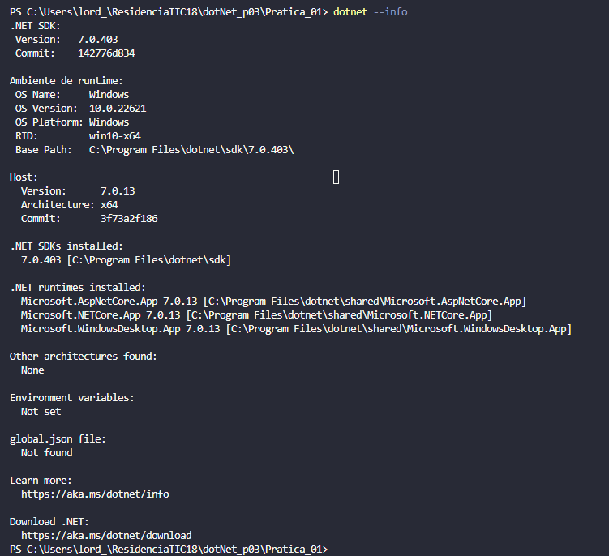
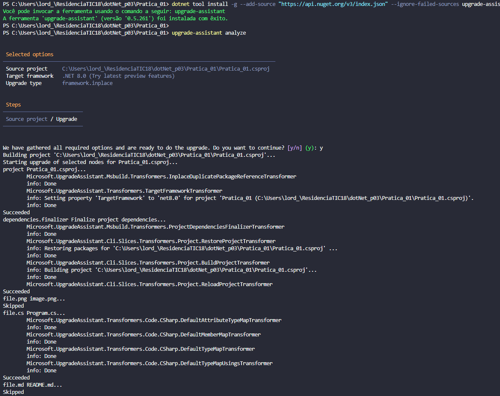

# Pratica 01 - .NET

Comando para verificar a versão do SDK:

 > dotnet --info

 
Comando para remover:

 

> dotnet-core-uninstall

 
Comandos para atualizar:

 

> dotnet tool install -g --add-source "https://api.nuget.org/v3/index.json" --ignore-failed-sources upgrade-assistant

> upgrade-assistant upgrade

